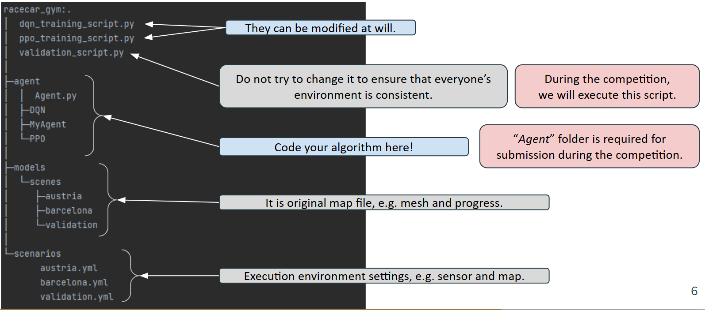
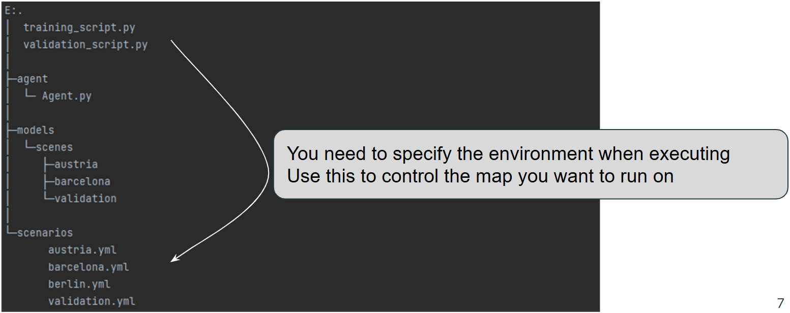
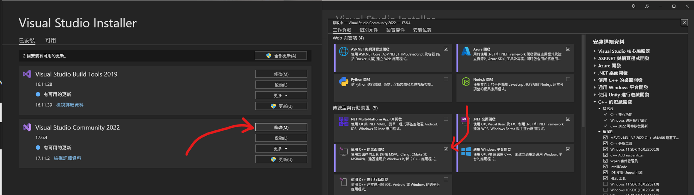

# Racecar Gym

* Competition PPT link : [https://docs.google.com/presentation/d/1J6RE2CaqmXGGYuwT6-_0erj9Yp3HIR30mk6lciRfBpY/edit?usp=sharing](https://docs.google.com/presentation/d/1J6RE2CaqmXGGYuwT6-_0erj9Yp3HIR30mk6lciRfBpY/edit?usp=sharing)
* Here is the chinese version : [README_zh.md](README_zh.md)
> The content of the Chinese version has not been verified. Please refer to the English version for important information.

## Competition Rules
* Please use Pytorch to finish the competition.
* During the mid-term competition, only the environment provided by this document will be used, so please be careful not to include other third-party libraries in the submitted code.
* The mid-term competition will be held in two rounds. 10 players from the 1st round will advance to the 2nd round. In the end, only one player can win the championship.
* We will use the sensors and settings described in `scenarios/validation.yml`

## How to deliver your code and RL agent ?
* Put the weight and code of all models under the `agent` folder
* Compress the `agent` folder into a `zip file` and upload it to moodle
  > the submission location will be provided in the future

## How to verify your code and RL agent can be used ?
* Download the project again 
    > hereinafter referred to as a `new project`
* Follow the following command to re-establish a new virtual environment
    > this step ensures that your code can be executed in the standard environment provided by this project
    ``` shell
    # uninstall env
    conda deactivate
    conda env remove -n racing
    # re-install env
    conda env create -f environment.yml
    conda activate racing
    pip install -e .
    pip install torch==2.0.1 torchvision==0.15.2 torchaudio==2.0.2 --index-url https://download.pytorch.org/whl/cu118
   ```
* Place your `agent` folder into the `new project`
* Execute `python validation_script.py`
* If it can be executed normally, it means that your submission documents are fine.

## How to control the car and training a RL agent ?

> !!!!!!!!! NOTE THAT !!!!!!!!!  
> The scenarios: `validation.yml` and `validation2.yml` couldn't use for training  
> If they are used for training, unknown errors may result  
> These two senarios are only used to verify the algorithm  
> 如果使用他們來進行訓練，可能會導致未知錯誤  
> 這兩個senarios僅用來驗證算法用  

* Modify the Agent.get_action function in the agent/Agent.py script.
* Implement your RL algorithm within the Agent.get_action function to control the car.


## What should I do if I encounter an environment installation error?
* See section **Troubleshooting** as below

---

[//]: # (![berlin track]&#40;docs/racecar_gym.gif&#41;)

## Installation

> The following steps only verify on windows10
1. Install [Anaconda](https://www.anaconda.com/download/success)
2. Execute the following command under the project folder
    ```shell
    # For windows
    conda env create -f environment.yml
    conda activate racing
    pip install -e .
    #  If you have a GPU
    pip install torch==2.0.1 torchvision==0.15.2 torchaudio==2.0.2 --index-url https://download.pytorch.org/whl/cu118
    # If you don't have a GPU
    # pip install torch==2.0.1 torchvision==0.15.2 torchaudio==2.0.2 --index-url https://download.pytorch.org/whl/cpu
    ```
3. For testing the environment, Execute the following command
    ```shell
    conda activate racing
    python validation_script.py
    ```

---

## Project structure



---

## Environments

The observation and action space is a `Dict` holding the agents and their id's. The observation and action space for a single agent 
is also a `Dict`, which is described in more detail below. In general, observations are obtained through sensors and commands
are executed by actuators. Vehicles can have multiple sensors and actuators. Those are described in the vehicle configuration
(e.g. [differential racecar](models/vehicles/racecar/racecar.yml)). Agents, which consist of a vehicle and an assigned task,
are specified in the scenario file (e.g. [austria.yml](scenarios/multi_austria.yml)). In this file, agents are described by the
sensors to use (note that they must be available in the vehicle configuration) and the corresponding task. Have a look at
[tasks.py](racecar_gym/core/tasks.py) to see all available tasks.

**Example:**
```yaml
world:
  name: austria
agents:
  - id: A
    vehicle:
      name: racecar
      sensors: [lidar, pose, velocity, acceleration]
      actuators: [motor, steering]
      color: blue # default is blue, one of red, green, blue, yellow, magenta or random
    task:
      task_name: maximize_progress
      params: {laps: 1, time_limit: 120.0, terminate_on_collision: False}
```

This example specifies a scenario on the [Austria](models/scenes/austria/austria.yml) track.
One agent with id **A** is specified. The agent controls the differential drive racecar defined in [differential racecar](models/vehicles/racecar/racecar.yml), identified by its name.
The scenario tells the agent to use only the specified sensors (lidar, pose, velocity, acceleration). 
Optionally, one can also specify a color for the car. The default color is blue. Available colors are listed above.

The task which is assigned to this agent is also identified by name (implementations can be found in [tasks.py](racecar_gym/core/tasks.py)). Task parameters are passed by the dict *params*.

### Observations

Observations are obtained by (possibly noisy) sensors. Parameters for the sensors as well as the level of noise, can be
configured in the corresponding vehicle configuration (e.g.  [differential racecar](models/vehicles/racecar/racecar.yml)). 
In the scenario specification, one can specify which of the available  sensors should be actually used. 
The observation space is a dictionary where the names of the sensors are the keys 
which map to the actual measurements. Currently, five sensors are implemented:
pose, velocity, acceleration, LiDAR and RGB Camera. Further, the observation space also includes the current simulation time.

| Key          | Space                       | Defaults                  | Description                                                                                    |
|--------------|-----------------------------|---------------------------|------------------------------------------------------------------------------------------------|
| pose         | `Box(6,)`                   |                           | Holds the position (`x`, `y`, `z`) and the orientation (`roll`, `pitch`, `yaw`) in that order. |
| velocity     | `Box(6,)`                   |                           | Holds the `x`, `y` and `z` components of the translational and rotational velocity.            |
| acceleration | `Box(6,)`                   |                           | Holds the `x`, `y` and `z` components of the translational and rotational acceleration.        |
| lidar        | `Box(<scans>,)`             | `scans: 1080`             | Lidar range scans.                                                                             |
| rgb_camera   | `Box(<height>, <width>, 3)` | `height: 240, width: 320` | RGB image of the front camera.                                                                 |

### Actions
The action space for a single agent is a defined by the actuators of the vehicle. 
**By default**, [differential racecar](models/vehicles/racecar/racecar.yml) defines two actuators: motor and steering. 
The action space is therefore a dictionary with keys `motor` and `steering`.

Alternatevely, the agent can control the target speed and steering, but must be defined in the scenario specification.
In this case, the action space is a dictionary with keys `speed` and `steering`.

Note, that the action space of the car is normalized between -1 and 1.
The action space can include the following actuators:

| Key      | Space                             | Description                                                   |
|----------|-----------------------------------|---------------------------------------------------------------|
| motor    | `Box(low=-1, high=1, shape=(1,))` | Throttle command. If negative, the car accelerates backwards. |
| speed    | `Box(low=-1, high=1, shape=(1,))` | Normalized target speed.                                      |
| steering | `Box(low=-1, high=1, shape=(1,))` | Normalized steering angle.                                    |

### State
In addition to observations obtained by sensors, the environment passes back the true state of each vehicle in each
step (the state is returned as the *info* dictionary). The state is a dictionary, where the keys are the ids of all agents.
Currently, the state looks like this:

| Key                 | Type         | Description                                                                                                |
|---------------------|--------------|------------------------------------------------------------------------------------------------------------|
| wall_collision      | `bool`       | True if the vehicle collided with the wall.                                                                |
| opponent_collisions | `List[str]`  | List of opponent id's which are involved in a collision with the agent.                                    |
| pose                | `NDArray[6]` | Ground truth pose of the vehicle (x, y, z, roll, pitch, yaw).                                              |
| acceleration        | `NDArray[6]` | Ground truth acceleration of the vehicle (x, y, z, roll, pitch, yaw).                                      |
| velocity            | `NDArray[6]` | Ground truth velocity of the vehicle (x, y, z, roll, pitch, yaw).                                          |
| progress            | `float`      | Current progress in this lap. Interval: [0, 1]                                                             |
| time                | `float`      | Simulation time.                                                                                           |
| checkpoint          | `int`        | Tracks are subdivided into checkpoints to make sure agents are racing in clockwise direction. Starts at 0. |
| lap                 | `int`        | Current lap.                                                                                               |
| rank                | `int`        | Current rank of the agent, based on lap and progress.                                                      |
| wrong_way           | `bool`       | Indicates wether the agent goes in the right or wrong direction.                                           |
| observations        | `Dict`       | The most recent observations of the agent.                                                                 |

## Available API's

`racecar_gym` currently implements the [Gym API](https://www.gymlibrary.ml/) and the [PettingZoo API](https://www.pettingzoo.ml/).

### Gym API
To use the *Gym API* you can either instantiate environments with the standard keys or by loading custom scenarios.
In either case, you have to load the `gym_api` module from this package:
```python
import gymnasium
import racecar_gym.envs.gym_api

# For predefined environments:
env = gymnasium.make(
    id='SingleAgentAustria-v0',
    render_mode='human'
)

# For custom scenarios:
env = gymnasium.make(
    id='SingleAgentRaceEnv-v0', 
    scenario='path/to/scenario',
    render_mode='rgb_array_follow', # optional
    render_options=dict(width=320, height=240, agent='A') # optional
)

done = False
reset_options = dict(mode='grid')
obs, info = env.reset(options=reset_options)

while not done:
    action = env.action_space.sample()
    obs, rewards, terminated, truncated, states = env.step(action)
    done = terminated or truncated

env.close()
```

## Maps

Currently available maps are listed below. The gridmaps are originally from the [F1Tenth](https://github.com/f1tenth) repositories.

| Image                                 | Name     |
|---------------------------------------|----------|
|    | Austria  |                                                                                                   |
|      | Berlin   |
|  | Montreal |
|      | Torino   |
|      | Circle   |
|  | Plechaty |

---

## Troubleshooting
### error: Microsoft Visual C++ 14.0 or greater is required.
1. Download and install Visual Studio 2022 Installer ([here](https://visualstudio.microsoft.com/zh-hant/visual-cpp-build-tools/))
2. Install c++ package, As shown below


3. Delete the racing environment and re-install again
   ```
    # uninstall env
    conda deactivate
    conda env remove -n racing
    # re-install env
    conda env create -f environment.yml
    conda activate racing
    pip install -e .
    pip install torch==2.0.1 torchvision==0.15.2 torchaudio==2.0.2 --index-url https://download.pytorch.org/whl/cu118
   ```

## Acknowledgments
* This project is modified from [axelbr/racecar_gym](https://github.com/axelbr/racecar_gym.git)